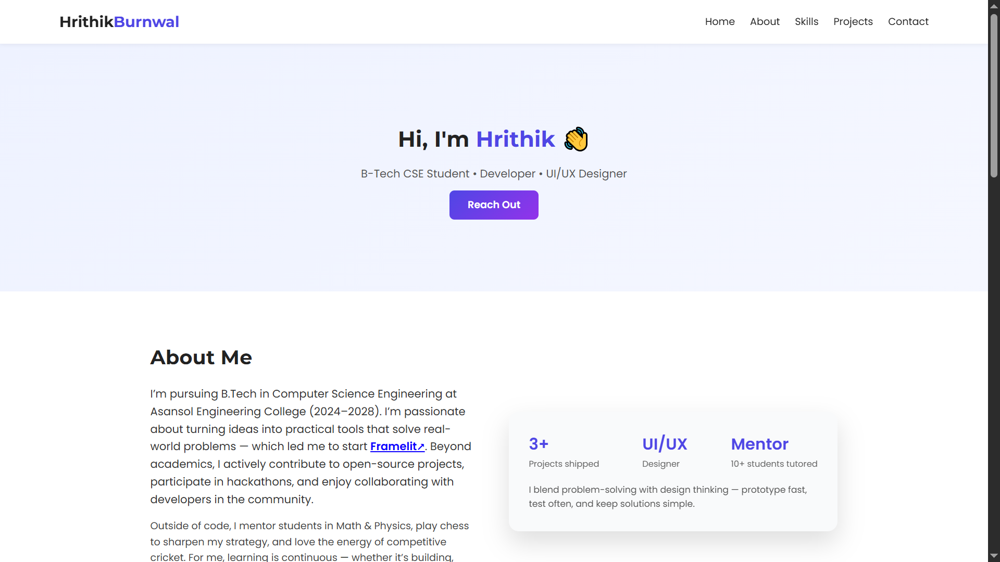
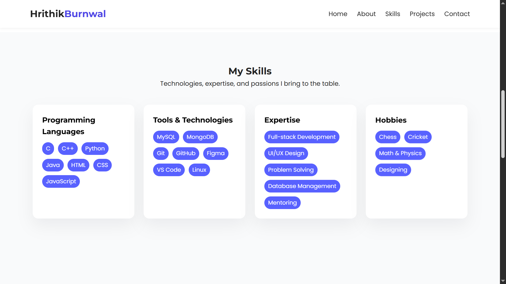
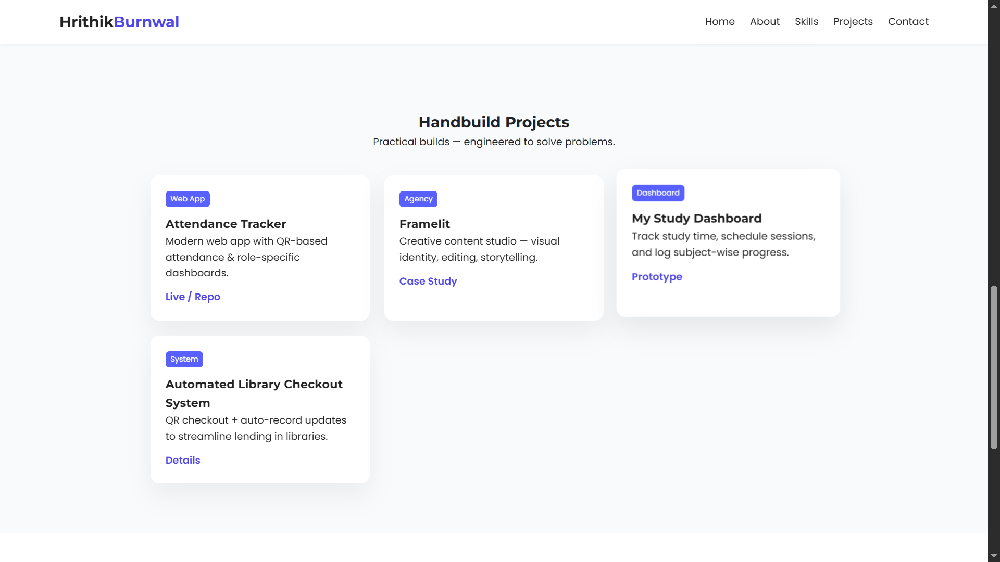
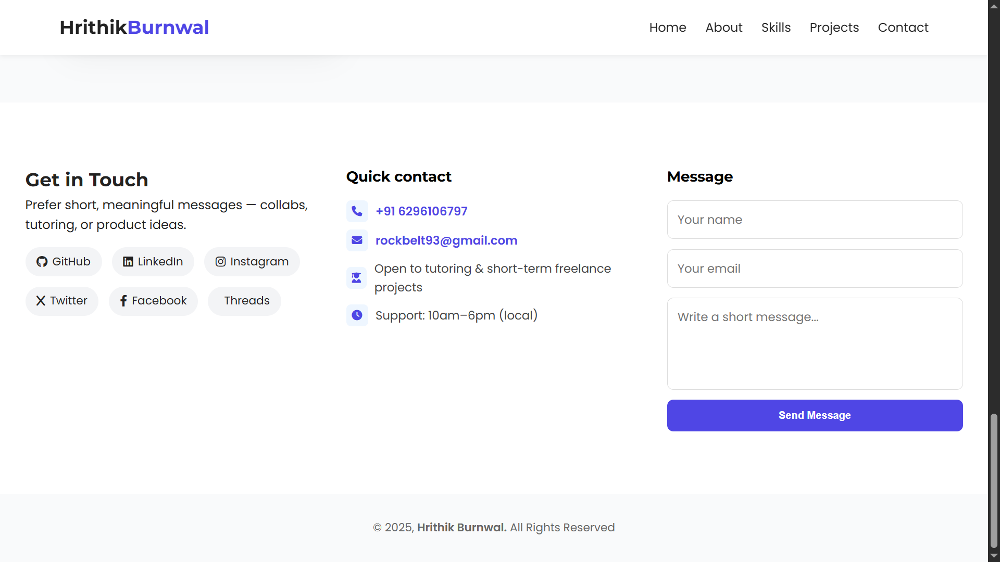

# 🌐 Personal Portfolio

A modern and responsive **portfolio website** built with **HTML, CSS, and JavaScript** to showcase my projects, skills, and contact details.  

---

## 📌 Features
- 🎨 Clean & Minimal Light Theme  
- 📱 Fully Responsive Design (mobile-friendly)  
- 🖼️ Projects Section with interactive cards  
- 🛠️ Skills Section with animated skill cards  
- 👤 About Section with animated info cards  
- 📬 Contact Section with quick links (Email, LinkedIn, GitHub, Facebook, X)  
- 🔔 Copy-to-clipboard email with Toast notification  

---

## 🛠️ Tech Stack
- **HTML5**  
- **CSS3 (Flexbox, Grid, Animations)**  
- **JavaScript (vanilla)**  

---

## 🚀 Deployment
This portfolio is deployed with [Vercel](https://vercel.com).  

🔗 Live Demo: [https://portfolio-hrithik-burnwal.vercel.app](https://portfolio-hrithik-burnwal.vercel.app)  

---

## 📸 Preview
Portfolio Screenshot

---

## 📬 Contact
- 📧 Email: rockbelt93@example.com  
- 💼 LinkedIn: [Hrithik Burnwal](https://linkedin.com/in/hrithik-barnwal-6aab3a208/)  
- 🐙 GitHub: [Hrithik-05-Roshan](https://github.com/Hrithik-05-Roshan)  
- 📘 Facebook: [Hrithik Burnwal](https://facebook.com/hrithik.burnwal.9)  
- 🐦 X (Twitter): [HrithikBurnwal](https://x.com/HrithikBurnwal)  

---
✨ Built with ❤️ by [Hrithik](https://github.com/Hrithik-05-Roshan)
